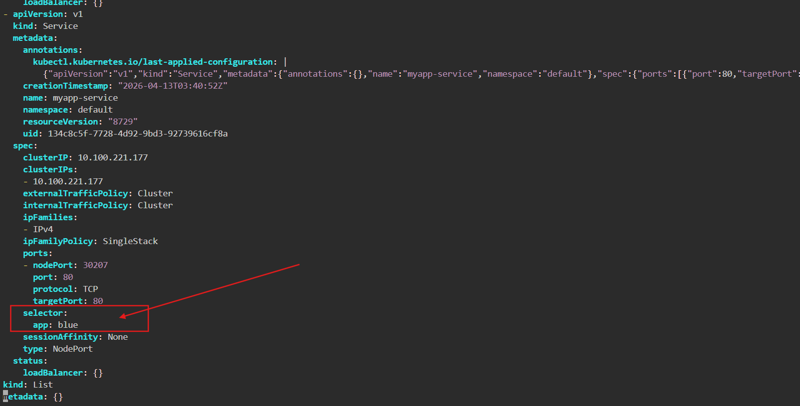
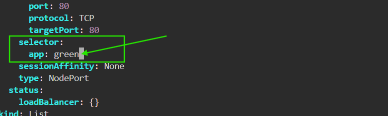

# 🚀 Blue-Green Deployment in Kubernetes

---

## 📌 Project Overview

This project demonstrates **Blue-Green Deployment** using Kubernetes with a **NodePort Service**.

* 🔵 Blue = v1 (current version)
* 🟢 Green = v2 (updated version)

Traffic switching is controlled using **Service selectors**.

---

## ⚙️ Prerequisites

* Kubernetes Cluster
* kubectl configured

---

## 📂 Project Structure

```bash
blue-green-k8s/
│
├── blue/
│   └── index.html
│
├── green/
│   └── index.html
│
├── blue-deployment.yaml
├── green-deployment.yaml
└── service.yaml
```

---

## 🚀 Setup

```bash
git clone https://github.com/gaikwaduddhav/blue-green-k8s.git
cd blue-green-k8s
```

---

### 🔧 Apply Configuration

```bash
# Create ConfigMaps
kubectl create configmap blue-html --from-file=blue/index.html
kubectl create configmap green-html --from-file=green/index.html

# Deploy applications
kubectl apply -f blue-deployment.yaml
kubectl apply -f green-deployment.yaml

# Expose service
kubectl apply -f service.yaml
```

---

### 🔍 Verify Resources

```bash
kubectl get pods
kubectl get svc
```

---

## 🌐 Access Application (IMPORTANT)

After running:

```bash
kubectl get svc
```

You will see output like:

```
NAME            TYPE       CLUSTER-IP     EXTERNAL-IP   PORT(S)        AGE
myapp-service   NodePort   10.96.0.1      <none>        80:30007/TCP   1m
```

### 👉 What this means:

* **80** = container port
* **30007** = NodePort (external access port)

---

### ✅ Steps to Access:

1. Get your **Node IP**

```bash
kubectl get nodes -o wide
```

Look for:

```
INTERNAL-IP or EXTERNAL-IP
```

---

2. Open browser and use:

```
http://<NodeIP>:30007
```

---

### 🎯 Example:

```
http://192.168.1.10:30007
```

👉 You will see:

```
Blue Version (v1)
```

---

## 🔁 Switch Blue → Green

```bash
kubectl edit svc myapp-service
```

Change:

```
app: blue → app: green

📸 Before Switching (Blue Active)

change this blue to green

```

👉 Traffic instantly shifts to **Green (v2)**

---

## 🔙 Rollback (Green → Blue)

```bash
kubectl edit svc myapp-service
```

Change:

```
app: green → app: blue
```

---

## ⚡ Result

* No downtime
* No pod restart
* Instant switching

---

## 🧠 Key Concept

```
selector:
  app: blue
```

👉 This controls:

* Traffic routing
* Deployment switching
* Rollback

---

## 📊 Key Takeaways

* Blue-Green ensures **zero downtime deployment**
* Two environments run simultaneously
* Service controls traffic
* Switching is instant
* Rollback is simple

---

## 📸 Demo

Blue → Green switching in real-time

---

## 👨‍💻 Author

Uddhav Gaikwad

